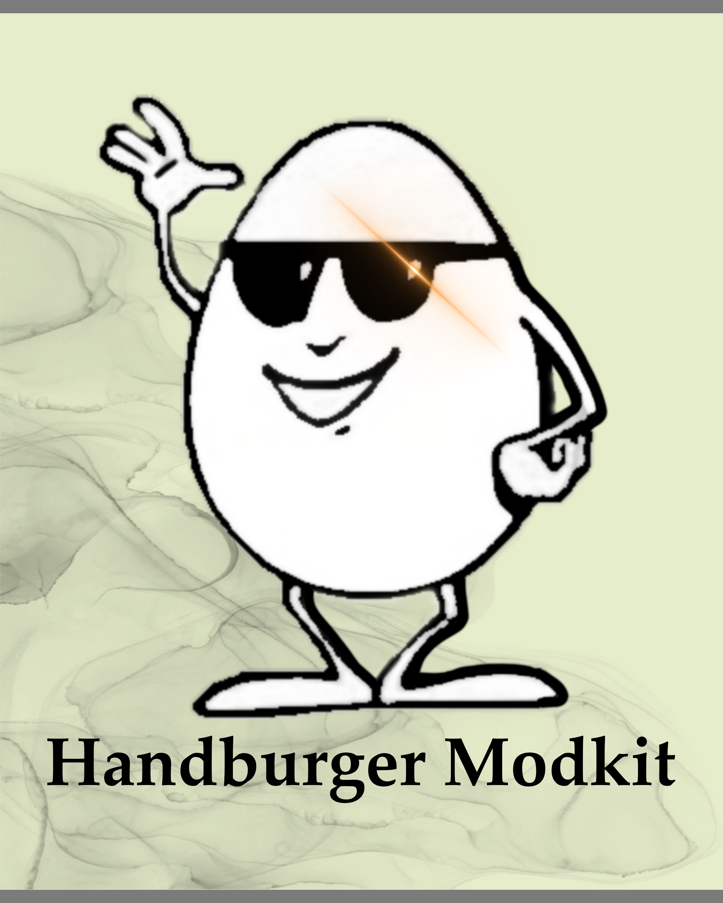

# Handburger Modkit

  
*A comprehensive modding toolkit for Monster Hunter Generations Ultimate (MHGU).*

[](https://ko-fi.com/L3L711AIP8)

## Table of Contents

- [Introduction](#introduction)
- [Features](#features)
- [Installation](#installation)
- [Usage](#usage)
  - [STQ Editor Tool](#stq-editor-tool)
  - [Opus Header Injector](#opus-header-injector)
  - [Audio Calculator](#audio-calculator)
  - [FolderMaker](#foldermaker)
  - [Hex Encoder/Decoder](#hex-encoderdecoder)
  - [NSOpus Converter](#nsopus-converter)
- [Future Features](#future-features)
- [Contributing](#contributing)
- [License](#license)

## Introduction

The **Handburger Modkit** is a robust toolkit designed for modders of Monster Hunter Generations Ultimate (MHGU). It brings together a suite of powerful tools for handling various aspects of the game, from audio conversions to hex editing and file management. Whether you're a seasoned modder or just starting out, this toolkit provides everything you need to create and manage mods with ease.

## Features

- **STQ Editor Tool**: Edit STQ files with a user-friendly interface.
- **Opus Header Injector**: Inject custom headers into `.opus` files for compatibility with MHGU.
- **Audio Calculator**: Calculate audio-related metrics quickly and efficiently.
- **FolderMaker**: Easily create and manage folder structures for your mods.
- **Hex Encoder/Decoder**: Convert between hex and other formats with a few clicks.
- **NSOpus Converter**: Convert various audio formats (mp4, mp3, flac, wav, ogg) into MHGU-compatible `.opus` files.

## Installation

### Prerequisites

- Python 3.6 or higher
- PyQt5

### Clone the Repository

```bash
git clone https://github.com/RTHKKona/Hand_Modkit.git
cd Hand_Modkit
Install Dependencies
Ensure you have all required Python packages:

```bash

pip install -r requirements.txt
Additional Dependencies
Make sure you have the following files in the scripts/data folder:

ffmpeg.exe
NXAenc.exe
NSOpusDirectory.txt
If any of these files are missing, please download them from the Hand_Modkit GitHub repository.

Usage
Running the Application
After installing the dependencies, you can run the Handburger Modkit with:

bash
COPY CODE
python Hb_Modkit.py
Tools Overview
STQ Editor Tool
This tool allows you to edit .stq files with a user-friendly interface. It provides hexadecimal editing capabilities and facilitates easy manipulation of file data.

Opus Header Injector
Inject custom headers into .opus files, making them compatible with MHGU. This is essential for audio modding within the game.

Audio Calculator
A tool designed to calculate various audio metrics quickly, making it easier to manage and convert audio files for your mods.

FolderMaker
Create and organize your mod’s folder structure effortlessly with the FolderMaker tool. This tool ensures that your files are organized and ready for deployment.

Hex Encoder/Decoder
Convert hexadecimal data into different formats and vice versa with ease. This tool is particularly useful for modders who need to work with hex values.

NSOpus Converter
The NSOpus Converter allows you to convert audio files in various formats (mp4, mp3, flac, wav, ogg) into .opus format compatible with MHGU. It includes features like drag-and-drop support, batch processing, and an intuitive interface.

Future Features
The following features are planned for future updates of the Handburger Modkit:

SBKR Reader/Editor: A tool for reading and editing SBKR files.
MCA/ADPCM Header Injector: A tool to inject or modify headers in MCA/ADPCM audio files.
Opus Metadata Extractor: A tool to extract metadata from .opus files.
Contributing
Contributions are welcome! Please feel free to submit a pull request or open an issue to discuss improvements or report bugs.

How to Contribute
Fork the repository.
Create a new branch (git checkout -b feature-branch).
Commit your changes (git commit -am 'Add new feature').
Push to the branch (git push origin feature-branch).
Create a new Pull Request.
License
This project is licensed under the GNU General Public License v3.0. See the LICENSE file for details.
